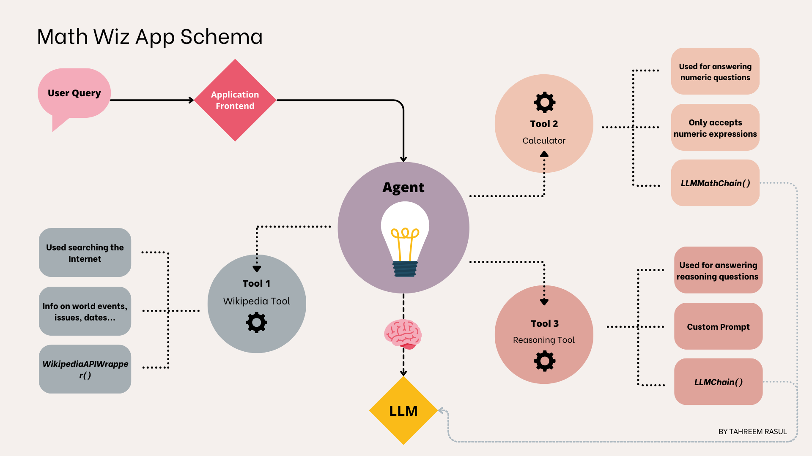
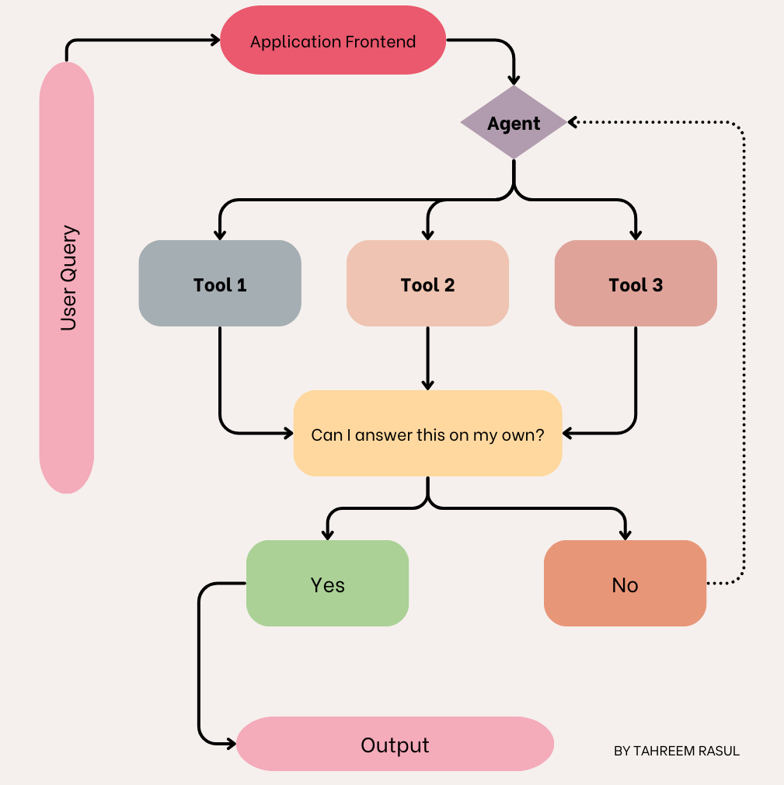

## Process Diagram
LangChain Agents are comprised of one or more tools that can be used by the agent to get to the final decision. These 
tools can be online search, or chains  carrying out modular tasks in an application flow. Below is the process 
diagram for the app designed in this tutorial:

For each user query, the agent uses the LLM to decide which tool to use. The flow of the agent can be visualized with 
this flow diagram:

## Install
install pip install -r requirements

## Run
streamlit run main.py
